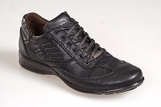
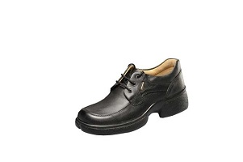
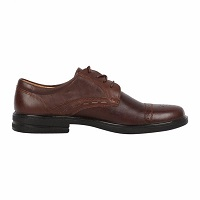
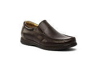

# Image Search Engine

This is a image search engine codebase in Python, OpenCV and Flask. The model is created based on chi2_distance between features.
Image Search Engine should be trained on your desired images. So, there is no predefined model to download. But training procedure is easy.
You have to copy your images in related directories. Consequently, running the flask application is proportional to start of training.
If you have any idea to enhance the accuracy of model or you have any idea to develop the description model,
it would be my pleasure to discuss about them. Feel free to contact me by sending an email to saman.masarat@gmail.com.  

## Requirements
`requirements.txt` contains whole of dependencies which are needed to run and develop this repository. Just run `pip install -r requirements.txt` in your virtual environment. 

Directory `data/` contains your dataset can be used for training model. You have to put training images in
`data/training_photos` directory. `data/descriptors` will be used for saving images descriptor. Descriptor files
will be used for measuring the similarity between any image with images which are existed on data directory.

### Running application
After installing dependencies existed in `requirements.txt`, run flask application with `flask run`. Check `log.log` for resolving any
probable error or warning. If application is running successfully, the model creation thread is started. You can check the 
model existence in `data/descriptors`.

## Sample outputs
Assume we have called `{{url}}:{{port}}/get_similars` with `file` from-data in Body part as below:

Our trained model returns images below as the most similar images which are existed in our database.
 
 

 

<!--
## Quick overview with Jupyter NoteBook
This [Jupyter Notebook](./train_test_sequnce.ipynb) represents the whole process includes training data, 
validating scores and results. You can review whole steps on this. Do not forget I have done these steps on my local images. 
You have to fill `data\training_photos` with your own images.
--> 

## Some Notes
There is no doubt that using advanced feature extraction methods, more process-consuming describing modules or 
other advanced manners can increase the model accuracy. We will add more advanced feature extractions and more advanced distance
measurements in near future. However I'm always enthusiastic to validate new methods in operational environments. So, 
If you have any idea, feel free to contact me.  

## Acknowledgements
Finally, I want to thank [Adrian Rosebrock](https://www.pyimagesearch.com/2014/12/01/complete-guide-building-image-search-engine-python-opencv/) 
article which inspired me to create and develop this repository.